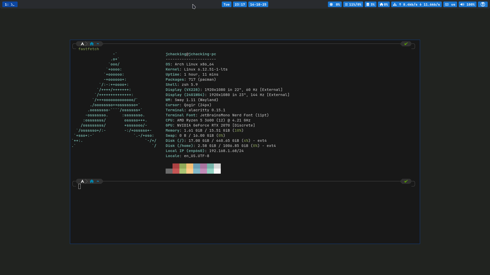

# dotfiles

These are my personal dotfiles for my computers.

I am uploading them in case they can serve as inspiration to someone, but I do not recommend using them directly as they contain personal settings such as my name, email, username, etc.

## Screenshots



## How it works

Dotfiles are managed with [dotter](https://github.com/SuperCuber/dotter) and deployed via [just](https://github.com/casey/just).

```bash
just apply    # Deploy dotfiles
just update   # Pull latest changes + apply
just unapply  # Remove deployed dotfiles
```

Machine-specific configurations live in `.dotter/`.

## Apps

| Category | Apps |
|---|---|
| Shell | zsh, starship |
| Terminal | alacritty |
| Editor | neovim |
| Window Manager | sway, swaylock, waybar, wofi, mako, sworkstyle |
| Git | git, lazygit, delta |
| System | podman, cargo, bat, lsd, imv, direnv |
| Security | gpg, ssh |
| Other | electron, xdg, uwsm, batsignal, swappy |

## Neovim

### Plugins

| Plugin | Purpose |
|---|---|
| mason | LSP server installer |
| nvim-lspconfig | Language Server Protocol |
| nvim-cmp | Autocompletion engine |
| LuaSnip + friendly-snippets | Snippets |
| neo-tree | File explorer |
| fzf | Fuzzy finder |
| gitsigns | Git decorations |
| lazygit | Git UI |
| toggleterm | Floating terminal |
| vim-dadbod | Database client |
| lualine | Status bar |
| alpha-nvim | Start screen |
| which-key | Keymap guide |
| nightfox | Color theme |

### Keymaps

`<leader>` is `Space`.

**General**

| Key | Action |
|---|---|
| `jk` | Exit insert mode |
| `<leader>nh` | Clear search highlights |
| `<leader>cl` | Toggle cursor lock to center |

**Buffers & Tabs**

| Key | Action |
|---|---|
| `<leader>n` | Next buffer |
| `<leader>p` | Previous buffer |
| `<leader>q` | Close buffer |
| `<leader>tn` | Next tab |
| `<leader>tp` | Previous tab |
| `<leader>tq` | Close tab |

**Windows**

| Key | Action |
|---|---|
| `<leader>h/j/k/l` | Navigate windows |
| `<leader>sv` | Split vertical |
| `<leader>sh` | Split horizontal |
| `<leader>s=` | Equalize splits |
| `<leader>sq` | Close split |

**File & Search**

| Key | Action |
|---|---|
| `<leader>e` | Toggle file explorer |
| `<leader>ff` | Find file |
| `<leader>fc` | Find content (ripgrep) |

**Git**

| Key | Action |
|---|---|
| `<leader>gg` | Open LazyGit |
| `]g` / `[g` | Next/prev hunk |
| `<leader>gs` | Stage hunk |
| `<leader>gS` | Stage buffer |
| `<leader>gu` | Undo stage hunk |
| `<leader>gr` | Reset hunk |
| `<leader>gR` | Reset buffer |
| `<leader>gp` | Preview hunk |
| `<leader>gb` | Blame line |
| `<leader>gd` | Diff this |

**LSP** (active when a language server is attached)

| Key | Action |
|---|---|
| `gd` | Go to definition |
| `gD` | Go to declaration |
| `gr` | References |
| `gi` | Go to implementation |
| `K` | Hover documentation |
| `<leader>rn` | Rename symbol |
| `<leader>ca` | Code actions |
| `<leader>d` | Show diagnostic |
| `[d` / `]d` | Next/prev diagnostic |

**Completion**

| Key | Action |
|---|---|
| `<C-n>` | Next item / expand snippet |
| `<C-p>` | Previous item / jump back |
| `<C-y>` | Confirm selection |
| `<C-e>` | Abort completion |
| `<C-Space>` | Trigger completion |

**Other**

| Key | Action |
|---|---|
| `<leader>tt` | Toggle terminal |
| `<leader>db` | Toggle DB UI |
